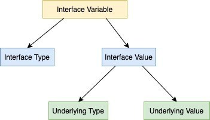

# Comparing

------------------------------------------

1. Comparing interface variables:
    Internal representation of interface variable containing Interface Type and Interface Value, and in turn under the hood, the Interface Value consists of Underlying Type and  Underlying Value
    So two interface variables is possible to compare if either 
    - Interface value is nil
    - Underlying Type is the same and comparable. Underlying Value is the same.
    
    
	
1. Comparing built-in types in Go: 
    - Some of comparable types: boolean, numeric, string, pointer, channel, struct(with all fields are comparable), interface types, array(each element type is comparable). And as opposed, some of types is not comparable: slice, map, func
    - Having failed at compiling time when comparing a struct or array with fields or element is not comparable
    - To compare on incomparable types by using reflect.DeepEqual(x interface{}, y interface {}), but be careful in usage due to some limitations.
